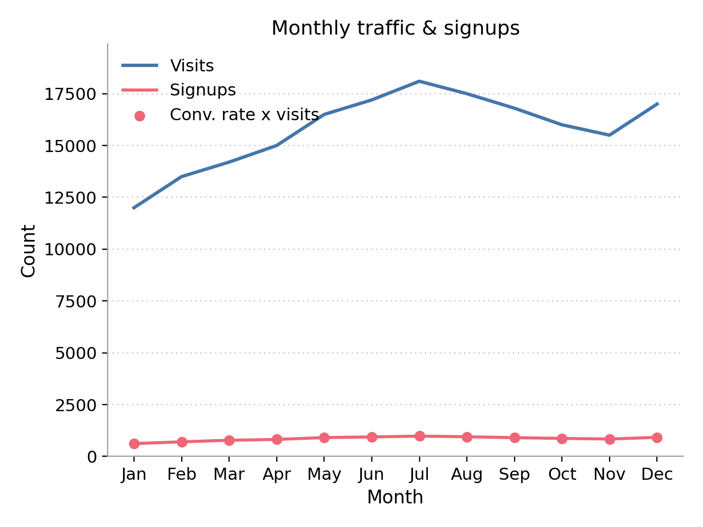
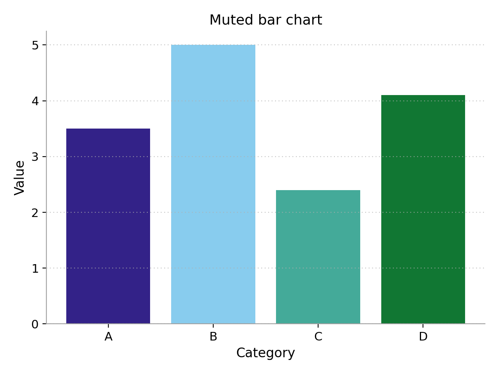
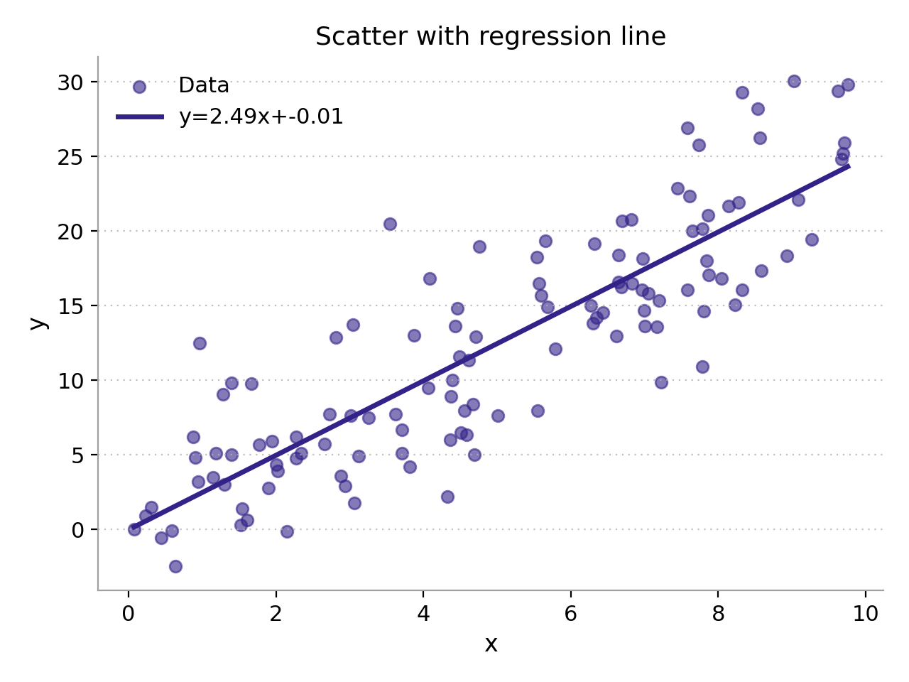
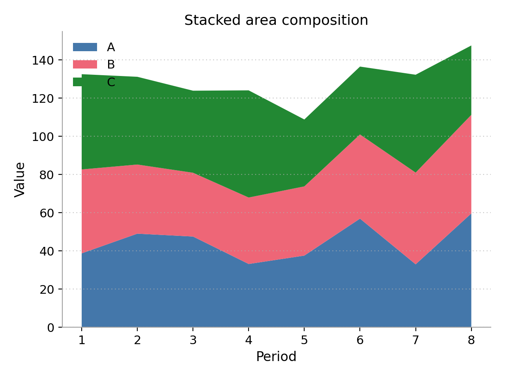

## Python Plot Template

A lightweight Matplotlib template package using Paul Tol color palettes. It sets a clean blank theme with reduced axes and densely dotted y-major gridlines.

### Features
- `apply_template(palette="bright", font_size=11, font_family=None, mathtext_fontset="cm")` — set a custom font if installed; mathtext uses Computer Modern by default
- Paul Tol colorblind-safe palettes (`bright`, `muted`) via `palette_colors`
- Utils: `save_plot`, `set_labels`, `set_limits`, `format_ticks`, `add_hline`, `add_vline`
- `style_context` context manager for temporary styling

### Installation
```bash
pip install -e '.[dev]'  # for local development with Ruff
```
Runtime only:
```bash
pip install matplotlib numpy
```

### Usage
```python
import matplotlib.pyplot as plt
from python_plot_template import (
    add_hline,
    apply_template,
    format_ticks,
    palette_colors,
    save_plot,
    set_labels,
    set_limits,
)

apply_template(palette="bright", font_size=12)
fig, ax = plt.subplots()
for color in palette_colors("bright"):
    ax.plot([0, 1, 2], [0, 1, 0], color=color)

add_hline(0.5, ax=ax, color="gray", linestyle="--")
set_labels("Example plot", "x", "y", ax=ax)
set_limits((0, 2), (0, 1.2), ax=ax)
format_ticks("{x:.1f}", axis="both", ax=ax)
save_plot("example.png", dpi=300, fig=fig)
plt.show()
```

Temporary style:
```python
import matplotlib.pyplot as plt
from python_plot_template import style_context

with style_context("muted"):
    plt.plot([0, 1], [0, 1])
    plt.show()
```

### Example script
```bash
python example_plot.py
```
This creates `example_plot.png` with the blank theme and Paul Tol colors.

Contents of `example_plot.py`:
```python
import matplotlib.pyplot as plt
import numpy as np

from python_plot_template import (
    apply_template,
    palette_colors,
    save_plot,
    set_labels,
)


def main() -> None:
    apply_template(palette="bright", font_size=12)

    x = np.linspace(0, 2 * np.pi, 200)
    signals = [
        ("sine", np.sin(x)),
        ("cosine", np.cos(x)),
        ("sine*exp", np.sin(x) * np.exp(-0.3 * x)),
    ]

    fig, ax = plt.subplots()
    for (label, y), color in zip(signals, palette_colors("bright"), strict=False):
        ax.plot(x, y, label=label, color=color, linewidth=2.0)

    set_labels("Minimal Tol-styled plot", "x", "f(x)", ax=ax)
    ax.legend(loc="best")

    save_plot("example_plot.png", dpi=200, fig=fig)
    plt.show()


if __name__ == "__main__":
    main()
```

### More examples
| Script | Preview | Command |
| --- | --- | --- |
| Line & Scatter (bright) |  | `python examples/line_and_scatter.py` |
| Muted Bar Chart |  | `python examples/muted_bar_chart.py` |
| Scatter with Regression |  | `python examples/scatter_regression.py` |
| Stacked Area |  | `python examples/stacked_area.py` |
| Correlation Heatmap |  | `python examples/heatmap_corr.py` |

Make them all at once:
```bash
make examples
```

### Tests
```bash
pytest
```
